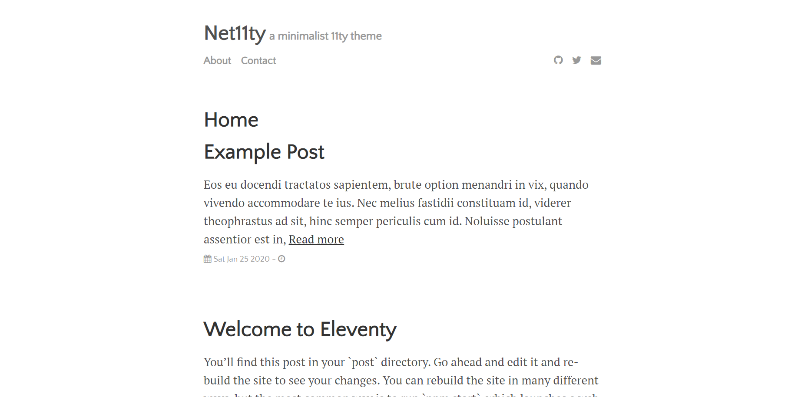

# Net11ty

> ✨ Bootstrapped with Create Snowpack App (CSA).

It contains :

- About page
- Blog post page
- Contact page
- Home page

## Available Scripts

### npm start

Runs the app in the development mode.
Open http://localhost:8080 to view it in the browser.

The page will reload if you make edits.
You will also see any lint errors in the console.

Open http://localhost:8080/admin/ to view the netlify admin page in the browser.

### npm run build

Builds a static copy of your site to the `build/` folder.
Your app is ready to be deployed!

**For the best production performance:** Add a build bundler plugin like "@snowpack/plugin-webpack" or "@snowpack/plugin-parcel" to your `snowpack.config.json` config file.

### Q: What about Eject?

No eject needed! Snowpack guarantees zero lock-in, and CSA strives for the same.
